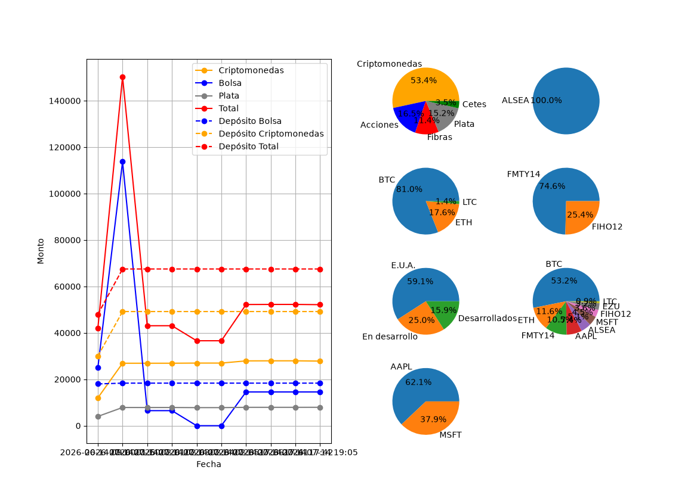

# Multi-Asset Portfolio Tracker / Monitor de Portafolio Multiactivo

A Python-based financial application designed to consolidate, track, and visualize a diverse investment portfolio including Stocks (US & Mexico), FIBRAs, Cryptocurrencies, Silver (physical/paper), and Cetes.

Una aplicación financiera en Python diseñada para consolidar, rastrear y visualizar un portafolio de inversión diverso que incluye Acciones (EE.UU. y México), FIBRAs, Criptomonedas, Plata (física/papel) y Cetes.

---

## Language / Idioma
* [Español (Spanish)](#español)
* [English](#english)

---

<a name="español"></a>
## Español

Este script automatiza la gestión de tu portafolio financiero conectándose a fuentes de datos en tiempo real para evaluar tus activos en pesos mexicanos (MXN), guardando un histórico diario en una base de datos local y generando gráficos analíticos avanzados.

### Características Principales
* **Consolidación Multiactivo:** Monitorea en un solo lugar Criptomonedas, Acciones Internacionales, Renta Variable Local (BMV), FIBRAs, Metales Preciosos y Renta Fija (Cetes).
* **Precios en Tiempo Real Inteligentes:** Integración optimizada con `yfinance` (`fast_info`) para obtener cotizaciones al momento, discriminando automáticamente entre mercados globales y locales (`.MX`).
* **API de Criptomonedas:** Conexión segura con la API de `CoinMarketCap` para valuar carteras cripto en MXN.
* **Base de Datos Local:** Uso de `sqlite3` para almacenar el histórico de tus saldos y depósitos sin depender de servicios en la nube.
* **Visualización Dinámica:** Gráficas avanzadas con `matplotlib` que muestran la evolución histórica del portafolio y la distribución porcentual por categorías (inmune a errores por valores en cero).

### Instalación y Configuración

1. **Clonar el repositorio:**
   ```bash
   git clone [https://github.com/tu-usuario/tu-repositorio.git](https://github.com/tu-usuario/tu-repositorio.git)
   cd tu-repositorio

2. **Crear e inicializar el entorno virtual:**
    ```bash
    python -bin/venv .venv
    source .venv/bin/activate  # En Mac/Linux
    # .venv\Scripts\activate  # En Windows

3. **Instalar dependencias:**
    ```bash
    pip install -r requirements.txt

4. **Configurar variables de entorno:**
    Crea un archivo .env en la raíz del proyecto basándote en .env.example:
    ```plaintext
    CMC_API_KEY=tu_api_key_de_coinmarketcap

5. **Inicializar la base de datos de prueba:**
    Para generar la estructura de tablas y cargar datos de demostración (incluyendo tickers como ALSEA, FMTY14, AAPL, etc.):
    ```bash
    python crear_base_prueba.py

6. **Ejecutar la aplicación:**
    ```bash
    python inversiones.py

<a name="english"></a>
## English

This script automates financial portfolio management by connecting to real-time data feeds to evaluate assets in Mexican Pesos (MXN), saving a daily historical record to a local database, and generating advanced analytical charts.

### Key Features
* **Multi-Asset Consolidation:** Tracks Cryptocurrencies, International Stocks, Local Equities (BMV), FIBRAs, Precious Metals, and Fixed Income (Cetes) all in one place.
* **Smart Real-Time Pricing:** Optimized integration with yfinance (fast_info) for instant quotes, automatically distinguishing between global and local (.MX) markets.
* **Cryptocurrency API:** Secure connection with the CoinMarketCap API to value crypto assets directly in MXN.
* **Local Database:** Uses sqlite3 to store historical balances and net deposits without relying on external cloud services.
* **Dynamic Visualization:** Advanced charts powered by matplotlib showing historical performance trends and asset allocation pie charts (robust against zero-value errors).

### Installation & Setup
1. **Clone the repository:**
    ```bash
    git clone [https://github.com/your-username/your-repository.git](https://github.com/your-username/your-repository.git)
    cd your-repository

2. **Create and initialize the virtual environment:**
    ```bash
    python -m venv .venv
    source .venv/bin/activate  # On Mac/Linux
    # .venv\Scripts\activate  # On Windows

3. **Install dependencies:**
    ```bash
    pip install -r requirements.txt

4. **Configure environment variables:**
    Create a .env file in the root directory based on .env.example:
    ```plaintext
    CMC_API_KEY=your_coinmarketcap_api_key_here

5. **Initialize the test database:**
    To build the table schema and seed mock data (including tickers like ALSEA, FMTY14, AAPL, etc.):
    ```bash
    python crear_base_prueba.py

6. **Run the application:**
    ```bash
    python inversiones.py

## Tech Stack / Tecnologías Utilizadas
* Language: Python
* Database: SQLite3
* APIs & Data: Yahoo Finance (yfinance), CoinMarketCap API
* Visualization: Matplotlib

## Capturas de pantalla/Screenshots


